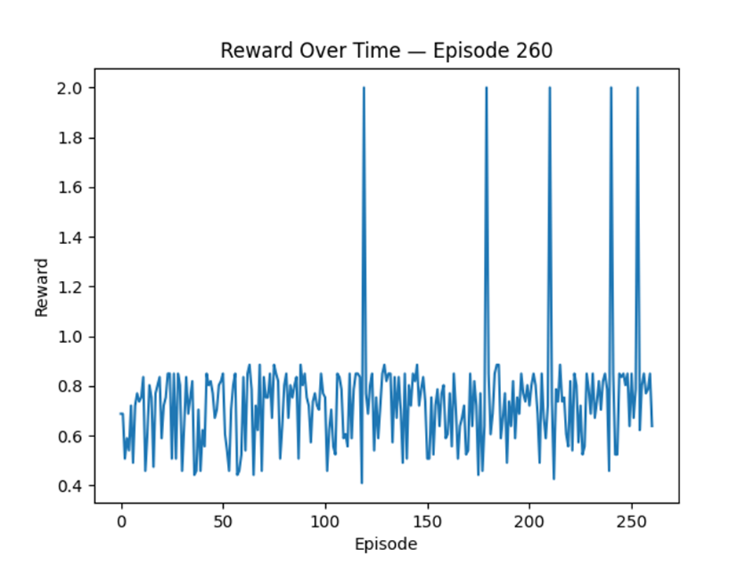

## Problem Statement
I want to be able to play the game *Disc Golf Valley*, but I don't want to have to play the game myself. I want a Machine Learning model to learn to play the game for me.

## Track Selection + Justification
I am choosing the Reinforcement Learning Track because this approach allows the model to learn how to play the game through experience and feedback from the environment. I want the model to learn how to play the game for itself reinforcement learning, instead of having to manually create large amounts of labeled training data, neural network.

## Explanation of Why This Approach Fits the Task
Reinforcement Learning is ideal for tasks that involve simple decisions, such as where to throw a disc, which mirrors how players interact with Disc Golf Valley. The game provides information such as distance to the hole, wind direction, and wind speed which can be inputs for the model with the reward calculated by the change in distance. This allows the model to autonomously learn strategies and optimize performance without manual gameplay.

## Backup Problem
In case the environment of Disc Golf Valley is too unstable, I will pivot my project to create a Reinforcement Learning Model for balancing the CartPole utilizing the Gymnasium Environment. 

## Baseline Training Run Reward Graph

## Baseline Training Run Output
throw clicked
Distance: 61
Wind Power: 2
Angle (0–360°): 102.52880770915152
Taking random action
End Distance: 14
Reward Calculation:0.7704918032786885
Episode 0, reward=0.770, epsilon=0.995
throw clicked
Distance: 61
Wind Power: 1
Angle (0–360°): 216.6341138759674
Taking random action
End Distance: 
OCR failed to read end distance due to single digit problems. Assigning default reward of 0.85
Episode 1, reward=0.850, epsilon=0.990
throw clicked
Distance: 61
Wind Power: 1
Angle (0–360°): 222.51044707800082
Taking random action
End Distance: 27
Reward Calculation:0.5573770491803278
Episode 2, reward=0.557, epsilon=0.985
throw clicked
Distance: 61
Wind Power: 1
Angle (0–360°): 215.94211187138234
Taking random action
End Distance: 26
Reward Calculation:0.5737704918032787
Episode 3, reward=0.574, epsilon=0.980
throw clicked
Distance: 61
Wind Power: 2
Angle (0–360°): 85.13548556223947
Taking random action
End Distance: 22
Reward Calculation:0.639344262295082
Episode 4, reward=0.639, epsilon=0.975
throw clicked
Distance: 61
Wind Power: 1
Angle (0–360°): 278.29714496983684
Taking random action
End Distance: 13
Reward Calculation:0.7868852459016393
Episode 5, reward=0.787, epsilon=0.970

